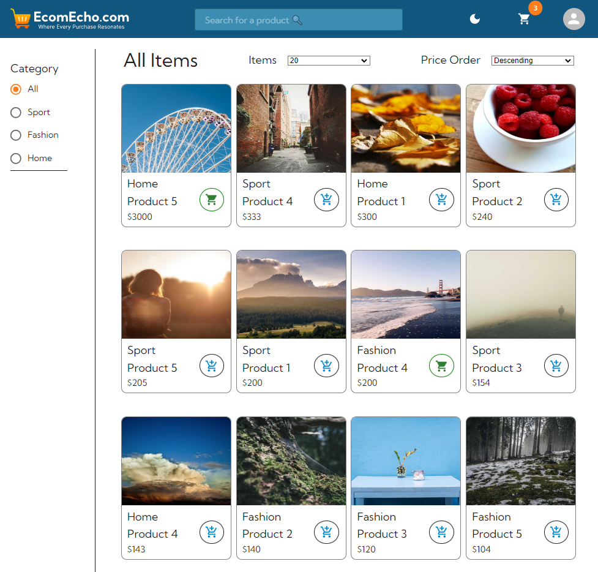

# E-commerce Front End Project


## Introduction

This is the frontend repo for Integrify FullStack Project. The frontend is using React & Redux and Material UI to make a fully-featured Ecommerce store called EcomEcho, utilizing the ASP.Net Core Backend API with PostgreSQL as database.

[Backend Repo in ASP.Net Core](https://github.com/haidanglevn/fs16_EcomEcho_Backend)

[Live website (hosted with Netlify)](https://ecomecho.netlify.app/)

[SwaggerUI for the backend (hosted with Azure](https://ecomecho.azurewebsites.net/swagger/index.html).

Remote PostgreSQL database is hosted in [ElephantSQL](https://www.elephantsql.com/).

## Table of Contents

- [Introduction](#introduction)
- [Getting Started](#getting-started)
  - [Prerequisites](#prerequisites)
  - [Installation](#installation)
- [Features](#features)
- [Screenshots](#screenshots)
- [Architecture & Design](#architecture--design)
  - [Folder Structure](#folder-structure)
- [Testing](#testing)

## Getting Started

### Prerequisites

- [NodeJS & Node Package Manager](https://nodejs.dev/en/download/)
- [Git](https://git-scm.com/)
- [Visual Studio Code](https://code.visualstudio.com/)

### Installation

You can visit the deployed version, or follow these steps to set it up as local repository.

1. Clone the repository:
   ```bash
   git clone https://github.com/haidanglevn/fs16_Frontend-project.git
   ```
2. Install all the dependencies:
   ```bash
   npm install
   ```
3. Run the app:
   ```bash
   npm start
   ```
4. (Optional) Run all the tests:
   ```bash
   npm run test
   ```

## Features

### Tech stacks:

- React
- Redux: for state management
- Material UI: for styling

### Features for normal customer:

- Fetch all products, filter them by price order and categories
- Choose a variant of a product and add them to cart, edit its quantities, empty the cart, create an order to purchase all items in the cart.
- Register for new account with email, Login, Logout, Edit profile info: change password, email, firstName, lastName and avatar
- Light & Dark Theme
- Responsive layout from phone, tablet and laptop screens

### Features for admin:

- All normal customer features
- Access to admin panel, where you can create, edit or delete products and users (also can create new Admin user), and view all orders (edit order functionalities is not ready)

## Screenshots

**Home page** shows a banner for sales & advertisement and set of categories to quickly go to the product page.


**Product page** shows all products from the database, with pagination to limit the amount of products from the API response. Here user can use the Search Bar to search for any product by title, and go straight to its Product Single Page.  


**Product Single** shows all the details of the products. By choosing a variant of size - color, user can see the amount of inventory left, and add them to the cart. Review feature, which is also being developed, is shown here as well.


**Cart Page**: Item in cart is seperated by variants, so two items of the same product, but different in variant will not be grouped together. User can clear the cart, change the quantity of the item (item with quantity 0 will be removed automatically) or click on Checkout to get to the CheckOut Page.


**CheckOut Page**: here user is required to login to proceed, as an order need the userId and addresses of the user. Here user have to choose one of the address as the shipping address, and a mock payment service. Then the Purchase button will be available to click, which complete the order creation process.


**Profile Page**: If user is already logged in, they can access profile page. The page currently has 3 tabs accessible from the left panel: Profile (default), Order (in the making) and Address. In **profile tab**, user can change its first, last name, password, email and avatar links. If password or email is changed successfully, user is prompted to login again. At the bottom of the page is a button to logout of the current user (which clear out the access token stored in localStorage) and a button to access Admin Panel, which is only visible if the user role is Admin.

In **address tab** user can see all the addresses and make change to them in the future.


**Admin Panel**: Only admin can access this page. Here there are 3 tabs for Users, Products and Orders. In **user tab**, admin can view all the users, make change to any fields (except avatar) by pressing "Edit" and then "Save" when done. Admin can also delete and create a new User/Admin account.


In **product tab**, admin can view, edit, delete any products in the database. They can also enter Create a product page to access this authorized functionality.


**Create A Product** page is a form for admin to create new product. Admin is required to have at least one image and one variant, in order to create a new product. Each product can have max 6 images, but unlimited amount of variant chosen by combination of colors and sizes, with a quantity from 1 to 300


The **order tab** is currently only showing all orders in the system. More functionalities is being added in the future.


Unfortunately, due to the limit of Material UI datagrid, Admin panel is not available for mobile screen size now, only for tablet and bigger.

## Architecture & Design

### Folder Structure (not fully updated yet)

- 📂 `root-directory/`
  - 📂 `src/`
    - 📂 `assets/`
      - 📂 `images/`
        - 📷 `bearSorry.png`
        - 📷 `empty-cart.png`
        - 📷 `icon-cart.svg`
        - 📷 `image-avatar.png`
        - 📷 `loading.gif`
        - 📷 `Logo.svg`
    - 📂 `components/`
      - 📄 `CartEmpty.tsx`
      - 📄 `Footer.tsx`
      - 📄 `Header.tsx`
      - 📄 `Layout.tsx`
      - 📄 `ProductCard.tsx`
      - 📄 `Register.tsx`
      - 📄 `SearchBar.tsx`
      - 📄 `SelectCategory.tsx`
      - 📄 `SelectItemsPerPage.tsx`
      - 📄 `SelectPriceOrder.tsx`
    - 📂 `hooks/`
      - 📄 `useScreenSizes.ts`
    - 📂 `pages/`
      - 📄 `AdminPage.tsx`
      - 📄 `CartPage.tsx`
      - 📄 `Login.tsx`
      - 📄 `ProductPage.tsx`
      - 📄 `ProductSingle.tsx`
      - 📄 `ProfilePage.tsx`
    - 📂 `redux/`
      - 📄 `store.ts`
      - 📄 `utils.ts`
      - 📂 `slices/`
        - 📄 `cartSlice.ts`
        - 📄 `categorySlice.ts`
        - 📄 `userSlice.ts`
        - 📄 `productSlice.ts`
    - 📂 `tests/`
      - 📂 `mocks/`
        - 📄 `handlers.ts`
        - 📄 `server.ts`
        - 📄 `mockData.ts`
      - 📄 `cartReducer.test.ts`
      - 📄 `categoryReducer.test.ts`
      - 📄 `productReducer.test.ts`
      - 📄 `userReducer.test.ts`
    - 📂 `types/`
      - 📄 `cartSlice.ts`
      - 📄 `categorySlice.ts`
      - 📄 `productSlice.ts`
      - 📄 `userSlice.ts`
    - 📂 `ultilities/`
      - 📄 `trimString.tsx`
    - 📄 `App.tsx`
    - 📄 `index.css`
  - 📄 `README.md`
  - 📄 `package.json`
  - 📄 `.gitignore`

## Testing

Unit tests are made for all 4 reducers.

## Deployment

The frontend is deployed in Netlify. Live page is here: [https://ecomecho.netlify.app/](https://ecomecho.netlify.app/)
